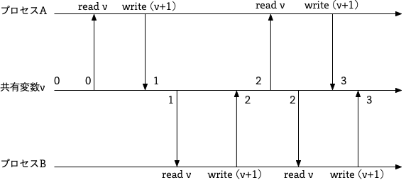
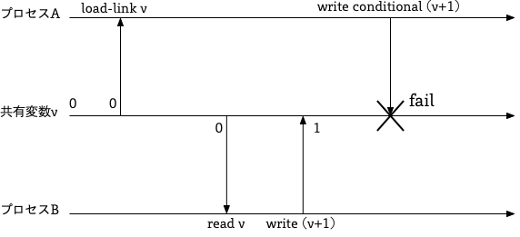
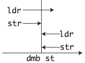
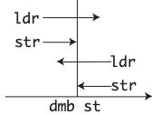

# 『並行プログラミング入門』の正誤表

下記の誤りがありました。お詫びして訂正いたします。

本ページに掲載されていない誤植など間違いを見つけた方は、japan＠oreilly.co.jpまで
お知らせください。pull requestでも報告いただけます。

## 第2刷

|頁    | 誤    | 正   |
| ---- | ---- | ---- |
| 2章。P.30。最後の行。| Gender型とほぼ同じあるが | Sex型とほぼ同じであるが |
| 3章。P.65。❷の3行目。 | 代入してして | 代入して |
| 3章。P.96。❶。 | ミューテックスと状態変数 | ミューテックスと条件変数 |
| 4章。P.131。4.7から3行目。 | IPC : instructions per second | IPS : instructions per second |
| 4章。P.131。4.7から8行目。 | IPC | IPS |
| 5章。P.157。下から7行目。 | `unistd::write,` | `unistd::{read, write},` |
| 5章。P.158。5.3.2.1の直前。 | 本実装ではこの関数を利用して eventfd に 1 を書き込むことで IOSelector へ通知し、IOSelector は読み込み後に 0 を書き込むことでイベント通知を解除する。 |  本実装ではこの関数を利用して eventfd に 1 を書き込み IOSelector へ通知し、IOSelector は eventfd を読み込みイベント通知を解除する。 |
| 5章。P.161。| この表の下にある説明を参照してください | |
| 6章。P.190。ソースコード右上の言語指定。 | ASM x86-64 | ASM AArch64 |
| 6章。P.198。下から3行目。 | `src/context.S` で示されるように | `Registers` 型の値を生成する `new` 関数の定義で示されるように |
| 7章。P.227。7.2.1から4行目。 | 重要な特徴な | 重要な特徴は |
| 8章。P.291。式中8行目。 | `▶ send(n2, b) ◀︎` | `▶ send(n3, b) ◀︎`  |
| 8章。P.294。5行目。 | recvSync | syncRecv |
| 8章。P.294。8.4より4行目。 | 非同期的のπ計算は | 非同期的なπ計算は  |
| 8章。P.298。3つ目の式中。 | ( P<sub>2</sub>.P.3) | (P<sub>2</sub>.P<sub>3</sub>) |
| 8章。P.302。真ん中の証明。 | 3. c̅x + 0 | 3. c̅x.0 + 0 |

### 5章。P.161。

以下の2行が追加必要です。

```rust
let mut buf: [u8; 8] = [0; 8];
read(self.event, &mut buf).unwrap(); // eventfdの通知解除
```

https://github.com/oreilly-japan/conc_ytakano/blob/1d2fcb0c68d1cb7986450c33b8d1952cb4fa3b7f/chap5/5.3/ch5_3_2_ioselect/src/main.rs#L146-L147

## 第1刷

|頁    | 誤    | 正   |
| ---- | ---- | ---- |
| はじめに。P.vi。5段目の5行目。| ミューテックスとなど | ミューテックスなど |
| 1章。p.11。ページ冒頭から8行目 | メモリアクスを行う | メモリアクセスを行う |
| 1章。P.11。14行目。 | 処理実行されるかを行われるかを表した | 命令列が実行されるかを表した |
| 1章。P.12。5行目。 | IDが | IFで |
| 1章。P.12。4段目の1行目。 | パイプライン処理を動作原理を | パイプライン処理の動作原理を |
| 2章。P.19。1つめのソースコード。 | ebxとecxを足して結果をeaxに保存 | ebxとecxを足して結果をecxに保存 |
| 2章。P.19。3段目。 | これは、ebxとecxレジスタの値を足し、その結果をeaxレジスタに保存するという命令となる。AArch64では保存先のレジスタを指定したが、x86-64は保存先のレジスタは基本的にeax(A レジスタ)となる。| これは、ebxとecxレジスタの値を足し、その結果をecxレジスタに保存するという命令となる。AArch64では保存先のレジスタを別に指定したが、x86-64は読み込みと書き込みレジスタが同じになる。| 
| 2章。P.19。3段目の1行目。 | オペレーションサフィックスはrとなる | オペレーションサフィックスはqとなる |
| 2章。P.21。ソースコードの下から7行目。| `perror("pthread_create");` | `perror("pthread_join");` |
| 2章。P.26。図2-1。| b = 10 | b = 20 |
| 2章。P.30。1つ目のソースコードの下から2行目。| `role: Person::Supporter(70)` | `role: Role::Supporter(70)` |
| 2章。P.30。3段目の1行目。| 初期化しなければならい。 | 初期化しなければならない。 |
| 2章。P.30。最後の行。| ほぼ同じあるが | ほぼ同じであるが |
| 2章。P.35。2.3.2.6より1行目。 | RustではCでいうwhileやdo whileはないため、代わりにloop文を用いて実現する。 | loop文は無限ループを行うための構文であり、loop文の他にC言語と同様のwhile文もある。 |
| 2章。P.36。2.3.2.7のソースコードより2行目。| ただし、&ast;=と、&ast;xと&ast;yにある&ast;は乗算の演算子である。 | ただし、&ast;=と、&ast;xと&ast;yとの間にある&ast;は乗算の演算子である。 |
| 2章。P.52。2つ目のソースコードの下から2行目。| `spawn(hello).join();` | `spawn(h).join();` |
| 3章。P.59。2行目。 | ただし、C 言語ではゼロが false、非ゼロが true を意味するため、返り値の型は int 型としている | これは不要な文章ですので読み飛ばしてください。 |
| 3章。P.59。❹の2行目。| eaxレジスタの下位8ビット | ecxレジスタの下位8ビット |
| 3章。P.62。図3-2。 |  |  |
| 3章。P.64。下段の1行目。 | MUTtual EXecution | MUTual EXclusion |
| 3章。P.65。❷の3行目。 | 代入してして | 代入して |
| 3章。P.73。ソースコード。main関数から4行目。 | `sem_open("/mysemaphore", O_CREAT, 0066, 3);` | `sem_open("/mysemaphore", O_CREAT, 0660, 3);` |
| 3章。P.74。❼の2行目 | 第3引数の0066は | 第3引数の0660 は |
| 3章。P.78。1つ目のソースコードの上から1行目。| `volatile int num = 10;` | `volatile int num = 0;` |
| 3章。P.79。2つ目のソースコードの❶の行。| `*cnt++;` | `(*cnt)++;` |
| 3章。P.93。1行目。 | 述語がfalseとなる間待機 | 述語がfalseとなるまで待機 |
| 3章。P.96。❶。 | ミューテックスと状態変数 | ミューテックスと条件変数 |
| 3章。P.105。下から9行目。 | チケットを取得か | チケットを取得中か |
| 3章。P.105。下から6行目。 | 番号は`ticket[i]`で | チケットは`ticket[i]`で |
| 4章。P.121。中段の1行目。 | Banker 構造体は、Resource 構造体内部に持つのみであり、 | Banker 構造体は、Resource 構造体を内部に持つのみであり、 |
| 4章。P.122。❶の説明。 | 銀行家の持っている箸の数 | 哲学者の持っている箸の数 |
| 4章。P.127。ソースコード `main` 関数後半。 | `printf("sprious wake up\n");` | `printf("spurious wake up\n");` |
| 4章。P.128。4.6 3行目。 | シグナルハンドラが呼び出せる | シグナルハンドラが呼び出される |
| 4章。P.131。❷の説明。 | `SIGNALS` 型を生成 | `Signals` 型を生成 |
| 4章。P.131。4.7から3行目。 | IPC : instructions per second | IPS : instructions per second |
| 4章。P.131。4.7から8行目。 | IPC | IPS |
| 4章。P.132。表4-3。2行目。dmb st。 | この命令以降のメモリ読み書き命令が | この命令以降のメモリ書き込み命令が |
| 4章。P.133。図4-9。dmb stの図。 |  |  |
| 4章。P.133。中段の1行目。 | stは先行するメモリ書き込み | stはメモリ書き込みのみ |
| 4章。P.133。中段の4行目。 | 一方行 | 一方向 |
| 5章。P.139。6行目。 | 再び電話を取る | 電話を取る |
| 5章。P.139。7行目。 | このように書いてしてしまうと | このように書いてしまうと |
| 5章。P.144。❸の3行目。 | 発生したイベントの数が Option 型で返る。 | 発生したイベントの数が Result 型で返る。 |
| 5章。P.146。下のソースコード。 | コメントの説明間違い | この正誤表のページ下記を参照してください |
| 5章。P.157。下から7行目。 | `unistd::write,` | `unistd::{read, write},` |
| 5章。P.158。5.3.2.1の直前。 | 本実装ではこの関数を利用して eventfd に 1 を書き込むことで IOSelector へ通知し、IOSelector は読み込み後に 0 を書き込むことでイベント通知を解除する。 |  本実装ではこの関数を利用して eventfd に 1 を書き込み IOSelector へ通知し、IOSelector は eventfd を読み込みイベント通知を解除する。 |
| 5章。P.161。| 2刷の正誤表下にある説明を参照してください | |
| 5章。P.178。最後の行。 | 必ず参考してほしい | 必ず参照してほしい |
| 6章。P.190。ソースコード右上の言語指定。 | ASM x86-64 | ASM AArch64 |
| 6章。P.198。下から3行目。 | `src/context.S` で示されるように | `Registers` 型の値を生成する `new` 関数の定義で示されるように |
| 6章。P.199。ソースコード中2行目コメント。 | スタックが使えなくなくなる | スタックが使えなくなる |
| 7章。P.211。1段目の6行目。| 気を付けなければならい。 | 気を付けなければならない。 |
| 7章。P.212。❷の説明。 | `NUM_LOCK` は 2n 倍でなければならない。 | `NUM_LOCK` は 2<sup>n</sup> でなければならない。 |
| 7章。P.227。7.2.1から4行目。 | 重要な特徴な | 重要な特徴は |
| 7章。P.228。下から9行目。 | このように、STM は競合が検知された場合に書き込まれ、そうでない場合はリトライされる | このように、STM は競合が検知されなかった場合に書き込まれ、検出された場合はリトライされる |
| 7章。P.229。下から4行目。 | `read-version`、`read-set`、`write-set`と呼ぶローカルデータと | `read-version`、`write-version`、`read-set`、`write-set`と呼ぶローカルデータと |
| 7章。P.230。6行目。 | 書き込みトランザクションはメモリ読み込みのみ可能な | 読み込みトランザクションはメモリ読み込みのみ可能な |
| 7章。P.260。7行目。 | そうするとで同じアドレスを | そうすることで同じアドレスを |
| 7章。P.262。表7-5の下より5行目。 | ロックフリーと呼ばれいていた意味に近く | ロックフリーと呼ばれていた意味に近く |
| 8章。P.268。1行目。 | カリー化された2引数とる関数であり | カリー化された2引数をとる関数であり |
| 8章。P.274。8.2.8より1行目。 | それともMの評価を | それともNの評価を |
| 8章。P.274。8.2.8より3行目。 | 引数M | 引数N |
| 8章。P.277。2行目。 | Y コンビネータは以下のような式となる。 | Y コンビネータと Z コンビネータはそれぞれ以下のような式となる。 |
| 8章。P.280。下から4行目。 | データの送信路を定義されていない。 | データの送信路は定義されていない。 |
| 8章。P.281。図8-3。 | 非同的送受信 | 非同期的送受信 |
| 8章。P.291。式中8行目。 | `▶ send(n2, b) ◀︎` | `▶ send(n3, b) ◀︎`  |
| 8章。P.294。5行目。 | recvSync | syncRecv |
| 8章。P.294。8.4より4行目。 | 非同期的のπ計算は | 非同期的なπ計算は  |
| 8章。P.295。8.4.1.2項名 | 送信 | 受信 |
| 8章。P.296。8.4.1.3より4行目。 | 懸命な読者なら | 賢明な読者なら |
| 8章。P.298。3つ目の式中。 | ( P<sub>2</sub>.P.3) | (P<sub>2</sub>.P<sub>3</sub>) |
| 8章。P.302。真ん中の証明。 | 3. c̅x + 0 | 3. c̅x.0 + 0 |
| 8章。P.308。2行目。 | `Sender<Sender<()>` | `Sender<Sender<()>>` |
| 付録A。P.321。6、8行目。 | AAarch64 | AArch64 |
| 付録A。P.333。表A-14。3行目。 | 0のビット反転 | reg = -1 |
| 付録A。P.338。例A-1。9行目のコメント。 | // x0 % 3 == 0 | // x0 % 5 == 0 |
| 付録A。P.339。❾の1行目の2箇所。 | FizzBuzz\n | Buzz\n |
| 付録B。P.343。B.2の1行目 | Gnu | GNU |
| 付録B。P.344。1つめのソースコード。 | ebxとecxを足して結果をeaxに保存 | ebxとecxを足して結果をecxに保存 |
| 付録B。P.345。表B-3。7行目。| D = (%rsp) | r/m = (%rsp) |

### P.29のGender表記について

[ISO 5218](https://ja.wikipedia.org/wiki/ISO_5218)によると、ヒトの身体的性別はGenderではなく、Sexとするのが正しい表記となります。
本文中のGenderはSexの誤りとなります。また、enumの定義は、正しくは以下となります。

```rust
enum Sex {
    Unknown,
    Male,
    Female,
    NotApplicable
}
```

### 5章。P.146。下のソースコード。コメント修正。

```Python
def hello():
    print('Hello,', end='')
    yield # ここで中断、再開 (1)
    print('World!')
    yield # ここまで実行 (2)

h = hello()  # イテレータを生成
h.__next__() # 1まで実行し中断
h.__next__() # 1から再開し2まで実行
```

### s/aqcuire/acquire/

本文やソースコードに複数登場する「aqcuire」は「acquire」のスペルミスとなります。

### 8章の「適用」の用い方について

8章の複数箇所で、「関数fに対して、引数aを適用する」といった形式の記述がありますが、
これらはすべて、「引数aに対して、関数fを適用する」が正しい記述となります。

具体的な修正箇所は以下となります。

|頁    | 誤    | 正   |
| ---- | ---- | ---- |
| P.266。3段落目。3行目。| λx.Mというλ式に値aを適用することは | 値aにλx.Mというλ式を適用することは |
| P.266。4段落目。1行目。| λx.x^2に数字の3を適用 | 数字の3にλx.x^2を適用 |
| P.266。下から1行目。| この式に値、3, 4を適用 | 値3, 4にこの式を適用 |
| P.267。3行目。 | λ式に3を適用した段階 | 3にλ式を適用した段階 |
| P.267。8行目。 | これに数字の2のみを適用 | 数字の2のみにこれを適用 | 
| P.267。9行目。 | この式に2を適用したものをF | 2にこの式を適用したものをF |
| P.267。12行目。 | 一部の引数のみに値を適用することを | 一部の引数のみに式を適用することを |
| P.268。2行目。 | 値3と、2乗する関数を、この式に適用すると | 値3と、2乗する関数に、この式を適用すると |
| P.277。8.2.9.1から4行目。 | (Y g) に定数 a を適用すると | 定数aに(Y g)を適用すると |
| P.278。8.2.9.3から3行目。 | 4を適用すると | 4に適用すると |
| P.279。1行目。 | 上式に定数 a を引数にして適用してみると | 上式を定数 a に適用してみると |

### 付録A。P.328。cmp命令の条件フラグについて

P.328の下から5行目で次のような記述がありますが、表が記載されていませんでした。

> ここで例として、符号なしの比較命令を考えてみると、比較命令実行後はオペランドの値により、ゼロフラグ(Z)とキャリーフラグ(C)は次の表のように変化する。

下記の表が正しい表となります。

`cmp a, b`後の条件フラグ

|       | Z | C |
|-------|---|---|
| a < b | 0 | 1 |
| a > b | 0 | 0 |
| a = b | 1 | 0 |

### 一部ePub版の文字列表記について

一部ePub版のソースコードでは、文字列をシングルクオーテーションで囲っているように表示されますが、ダブルクォーテーションとなります。
ファイルでは、ダブルクォーテーションとなっていますが、表示がシングルクォーテーションとなるようです。

```C
// 正しいコード例
printf("id = %d, i = %d\n", id, i);
```

```C
// 誤ったコード例
printf('id = %d, i = %d\n', id, i);
```

FirefoxのePubリーダを利用している方はご注意ください。
https://addons.mozilla.org/ja/firefox/addon/epubreader/

# 補足説明

## 3.7.3 実行速度計測の図

3.7.3 実行速度計測の図がモノクロで見難いため、カラー版を掲載いたします。

### 図3-6


### 図3-7


## 3.9 パン屋のアルゴリズム

パン屋のアルゴリズムの説明が少し足りないので、追加で説明します。

パン屋のアルゴリズムは、アトミック命令を使わずにN個のスレッド間でMutexを実現するアルゴリズムとなります。
ただし、Nは固定で動的に変化しません。

P.102で定義する`entering`と、`ticket`ですが、これはそれぞれ、i番目のスレッドがチケットを取得中であるかと、
i番目のスレッドのチケットを保存する配列となります。

ですので、P.102冒頭で定義している`BakerlyLock`構造体には、以下のようなコメントがあるほうがよいでしょう。

```rust
// パン屋のアルゴリズム用の型 ❹
struct BakeryLock {
    entering: [bool; NUM_THREADS],       // i番目のスレッドがチケットを取得中であるなら、entering[i]はtrue
    tickets: [Option<u64>; NUM_THREADS], // i番目のスレッドのチケットがtikect[i]
}
```

自身のスレッド番号をiとしたとき、そのスレッドiがロック獲得するには、
チケット獲得と他のスレッドの処理終了待機の2つを行います。

まず、以下のようにチケットを獲得します。

1. `entering[i] = true`として、チケットを取得中であると設定
2. `tickets[i]`からチケット番号の最大値を取得
3. 2で得た最大値 + 1を自分のチケット番号として、`tickets[i]`に設定
4. `entering[i] = false`と設定

その後、以下のようにして、自分以外の他のスレッドj（0からNUM_THREADS-1、ただしi以外）の処理が終了するのを待機します。
具体的には以下のように待機します。

1. `entering[j] == false`となるまでループで待機。つまり、他のスレッドがチケットを取得中なら待機。
2. `ticket[j]`の値が自分のチケット番号より小さい、もしくはチケット番号が同じでありかつ自分のスレッド番号の方がjより小さい場合はループで待機。

この2つの処理が終了するとロック獲得となり、これを行っているのが、3.9で示した`lock`関数のコードとなります。

## 4.3 銀行家のアルゴリズム

銀行家のアルゴリズムの本来のアルゴリズムは、必要なリソース数を指定可能です。
しかし、本書で示した実装では、必要なリソース数を1と定数値としています。
[issue51](https://github.com/oreilly-japan/conc_ytakano/issues/51)で、リソース数を指定可能に修正したパッチを頂きましたので、
[banker_rs.v2](https://github.com/oreilly-japan/conc_ytakano/blob/main/chap4/4.3/ch4_3_banker/src/banker_v2.rs)に、
修正版をアップロードしました。

パッチを作成して頂いた方および、読書会に参加して頂いた皆様に感謝します。

## 4.4 再帰ロック

再帰ロックのアルゴリズムで、`lock->id`の読み書きをアトミックに行った方が良いと指摘があました。
AArch64とx86-64でLLVMかGCCを利用していると問題はないとは思われます。
一方、C言語の規格から考えると、`lock->id`はアトミックとした方が良いとの指摘です。

修正後のソースコードは次のURLから確認してください。
https://github.com/oreilly-japan/conc_ytakano/blob/main/chap4/4.4/ch4_4_reent_c/reent.c

また、本件に関するissueは次のURLとなります。https://github.com/oreilly-japan/conc_ytakano/issues/61
